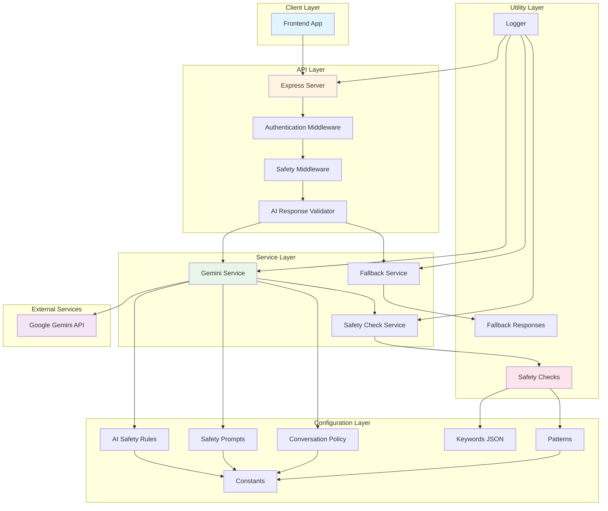
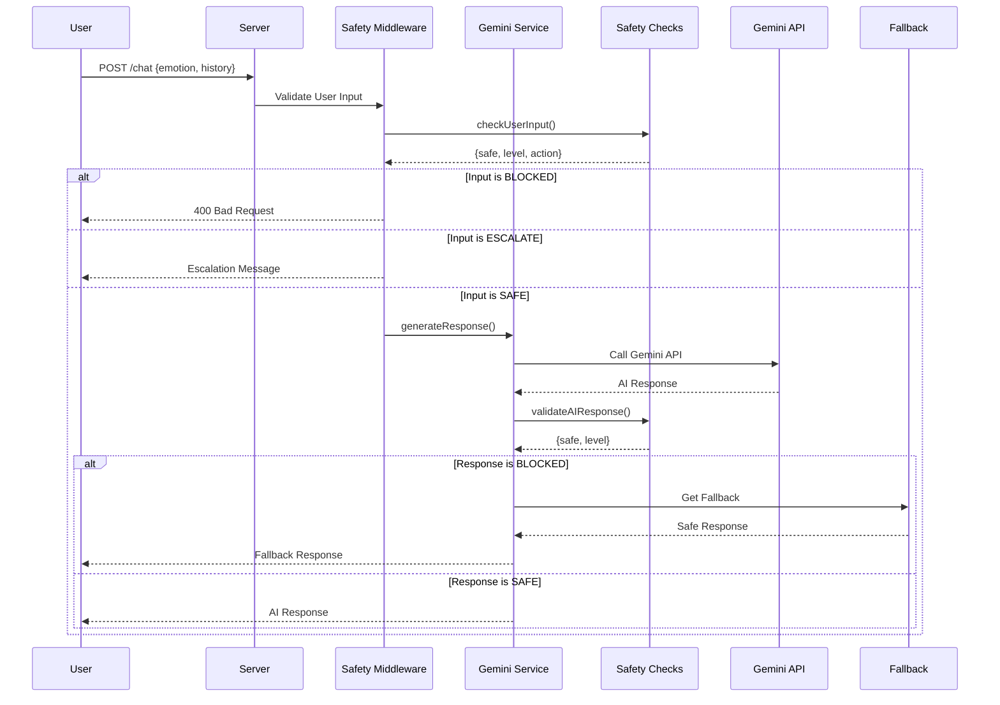
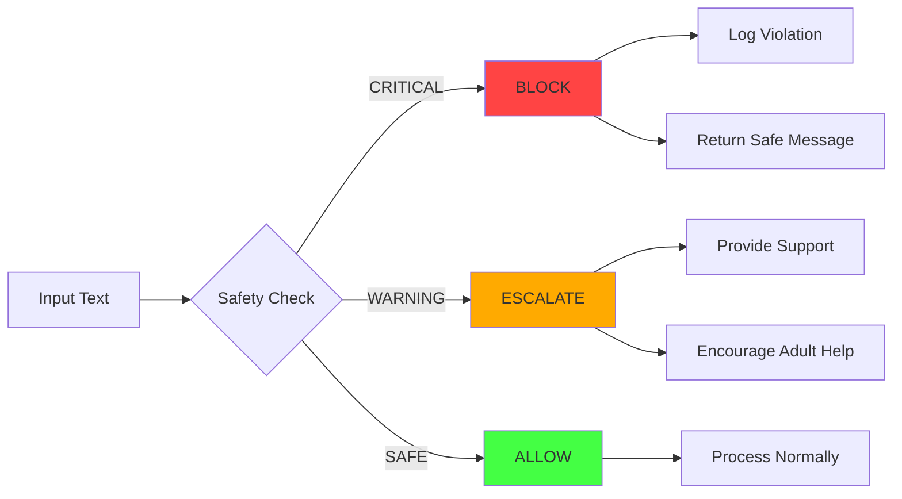
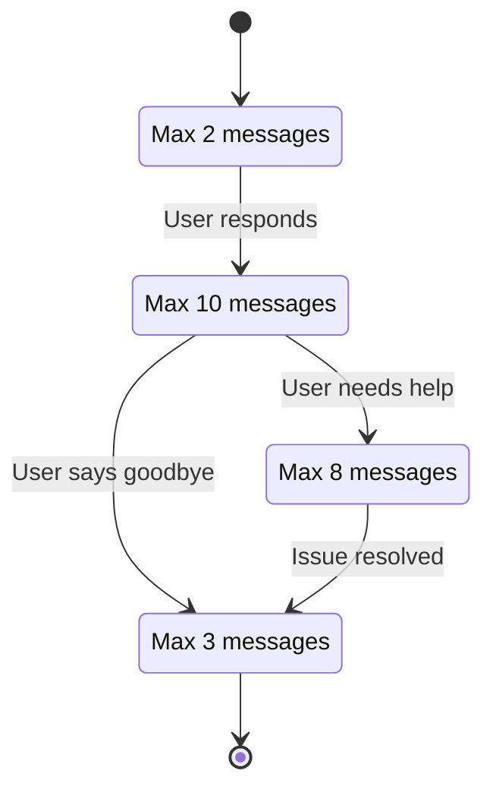

# EPIC-01: AI Safety Foundation - Architecture Diagram

## System Architecture Overview



## Request Flow Diagram



## Component Architecture

### 1. Configuration Layer

```
config/
├── aiSafetyRules.js          # Safety rules & keywords
├── safetyPromptTemplate.js    # Prompt templates
├── conversationPolicy.js      # Conversation phases
├── keywords.json              # Keyword database
├── constants.js               # App-wide constants
└── patterns.js                # Regex patterns
```

**Responsibilities:**
- Define safety rules and prohibited content
- Store keyword databases
- Define conversation phases and policies
- Centralize constants and configuration

### 2. Prompts Layer

```
prompts/
├── systemPrompt.js            # System prompt builder
└── safetyPrompt.js            # Safety-focused prompts
```

**Responsibilities:**
- Build context-aware prompts
- Inject safety guidelines
- Handle emotion-specific messaging

### 3. Middleware Layer

```
middleware/
└── safety.js                  # Safety validation middleware
```

**Responsibilities:**
- Pre-process user input
- Post-process AI responses
- Log safety violations
- Block/escalate dangerous content

### 4. Service Layer

```
services/
└── geminiService.js           # Gemini API integration
```

**Responsibilities:**
- Manage Gemini API calls
- Handle retries and errors
- Integrate safety checks
- Provide fallback mechanism

### 5. Utility Layer

```
utils/
├── safetyChecks.js            # Content filtering
├── fallbackResponses.js       # Fallback messages
└── logger.js                  # Unified logging
```

**Responsibilities:**
- Detect harmful content
- Generate fallback responses
- Provide consistent logging

### 6. Test Layer

```
tests/
└── safety.test.js             # Unit tests
```

**Responsibilities:**
- Test safety detection
- Validate keyword matching
- Ensure edge case handling

## Data Flow

### Chat Request Flow

```
1. User sends message
   ↓
2. Safety Middleware validates input
   ↓
3. Check keywords & patterns
   ↓
4. Check PII & aggressive language
   ↓
5. Determine safety level (SAFE/WARNING/CRITICAL)
   ↓
6. If CRITICAL → Block & log
   If WARNING → Escalate with support message
   If SAFE → Continue
   ↓
7. Gemini Service generates response
   ↓
8. Safety check on AI response
   ↓
9. If unsafe → Use fallback
   If safe → Return response
   ↓
10. Log all safety violations
```

### Safety Check Flow

```
Input Text
   ↓
┌──────────────────────────────────────┐
│ 1. Keyword Detection                 │
│    - Load keywords from JSON         │
│    - Check against WARNING_KEYWORDS  │
│    - Return matched categories       │
└──────────────────────────────────────┘
   ↓
┌──────────────────────────────────────┐
│ 2. Pattern Matching                  │
│    - Apply regex patterns            │
│    - Check 8 pattern categories      │
│    - Return matched patterns         │
└──────────────────────────────────────┘
   ↓
┌──────────────────────────────────────┐
│ 3. PII Detection                     │
│    - Phone numbers                   │
│    - Email addresses                 │
│    - Addresses                       │
│    - School names                    │
│    - Personal names                  │
└──────────────────────────────────────┘
   ↓
┌──────────────────────────────────────┐
│ 4. Advanced Detection                │
│    - Aggressive language scoring     │
│    - Manipulation/grooming patterns  │
└──────────────────────────────────────┘
   ↓
┌──────────────────────────────────────┐
│ 5. Severity Classification           │
│    - CRITICAL: Self-harm, abuse      │
│    - WARNING: Bullying, substance    │
│    - SAFE: No issues                 │
└──────────────────────────────────────┘
   ↓
Safety Level + Recommendations
```

## Safety Levels



## Conversation State Machine



## Directory Structure

```
backend/
├── src/
│   ├── config/
│   │   ├── aiSafetyRules.js
│   │   ├── safetyPromptTemplate.js
│   │   ├── conversationPolicy.js
│   │   ├── keywords.json
│   │   ├── constants.js
│   │   └── patterns.js
│   ├── prompts/
│   │   ├── systemPrompt.js
│   │   └── safetyPrompt.js
│   ├── middleware/
│   │   └── safety.js
│   ├── services/
│   │   └── geminiService.js
│   ├── utils/
│   │   ├── safetyChecks.js
│   │   ├── fallbackResponses.js
│   │   └── logger.js
│   └── ...
├── tests/
│   └── safety.test.js
├── docs/
│   └── EPIC-01-ARCHITECTURE.md
├── server.js
└── fallback.js
```

## Key Design Patterns

### 1. Singleton Pattern
- GeminiService uses singleton to ensure single instance
- Prevents multiple API client initializations

### 2. Middleware Pattern
- Safety middleware for request validation
- AI response validator for response filtering

### 3. Strategy Pattern
- Different fallback strategies based on error type
- Different escalation strategies based on severity

### 4. Factory Pattern
- Logger factory for creating component-specific loggers
- Fallback factory for context-aware responses

### 5. Observer Pattern
- Safety violation logging for mentor review
- Event-driven safety monitoring

## Security Features

### Multi-Layer Validation
1. **Input Validation**: Pre-processing safety checks
2. **AI Validation**: Post-processing response checks
3. **Pattern Matching**: Regex-based detection
4. **Keyword Detection**: Database-driven detection
5. **PII Detection**: Personal information protection

### Safety Mechanisms
- **Block**: Critical content blocked immediately
- **Escalate**: Warning content with support message
- **Allow**: Safe content processed normally
- **Fallback**: Safe responses when AI fails
- **Logging**: All violations logged for review

### Age-Appropriate Design
- Language suitable for 6-15 year olds
- No technical jargon
- Encouraging adult involvement
- Emotional support focus

## Performance Considerations

### Optimization Strategies
- Regex patterns compiled once
- Keywords loaded from JSON (cacheable)
- Singleton pattern for services
- Efficient pattern matching algorithms

### Scalability
- Modular architecture
- Easy to add new safety rules
- Pluggable detection modules
- Configurable thresholds

## Monitoring & Logging

### Log Levels
- **ERROR**: System errors, API failures
- **WARN**: Safety violations, retries
- **INFO**: Normal operations
- **DEBUG**: Detailed diagnostics

### Logged Events
- Safety violations (all levels)
- API calls (success/failure)
- Escalation events
- Fallback activations
- Performance metrics

## Testing Strategy

### Unit Tests
- Keyword detection (6 categories)
- Pattern matching (8 categories)
- PII detection (5 types)
- Aggressive language scoring
- Manipulation detection
- Escalation protocol
- Edge cases (null, empty, long text)

### Test Coverage
- 25+ test cases
- Positive and negative tests
- Edge case handling
- Error scenarios

## Dependencies

### External
- `@google/generative-ai`: Gemini API client
- `express`: Web framework
- `cors`: CORS middleware
- `bcryptjs`: Password hashing
- `jsonwebtoken`: JWT authentication

### Internal
- All modules in `src/` directory
- Modular and loosely coupled
- Clear dependency injection

## Deployment Considerations

### Environment Variables
- `GEMINI_API_KEY`: Gemini API key
- `JWT_SECRET`: JWT signing secret
- `PORT`: Server port
- `NODE_ENV`: Environment (development/production)
- `LOG_LEVEL`: Logging level (debug/info/warn/silent)

### Health Checks
- Gemini service availability
- API key configuration
- Safety system initialization

### Monitoring
- Safety violation rates
- API response times
- Fallback activation frequency
- Error rates by category

---

**Generated**: 2024-XX-XX
**Version**: 1.0
**Epic**: EPIC-01 - AI Safety Foundation